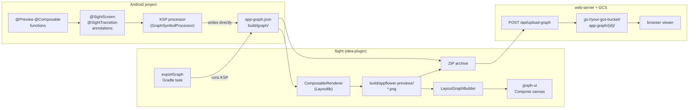

# Sight — Pipeline Reference

## Pipeline Overview



## Participants

### Android project side

| Component | Location | Role |
|-----------|----------|------|
| `@SightScreen` | `graph-annotations` library | Marks a `@Preview` function as a graph node |
| `@SightTransition` | `graph-annotations` library | Declares an edge to/from another screen or subgraph |
| `GraphSymbolProcessor` | `core/graph-processor` | KSP processor — resolves symbols, writes `app-graph.json` |
| `exportGraph` task | `build-logic/GraphExportPlugin` | Triggers KSP, produces the JSON artifact |

### Sight side

| Component | Module | Role |
|-----------|--------|------|
| `ModuleScanner` | `idea-plugin` | Discovers Gradle modules with `exportGraph` via Tooling API |
| `ModuleGraphPanel` | `idea-plugin` | IDE UI — "Build graph" button, renders graph panel |
| `ComposableRenderer` | `idea-plugin` | Renders `@Preview` functions to PNG via Android Studio's Layoutlib |
| `GraphLoader` | `graph-renderer` | Deserialises `app-graph.json` |
| `LayoutGraphBuilder` | `graph-renderer` | Computes node positions, loads PNG dimensions |
| `GraphImageRenderer` | `graph-renderer` | Renders `LayoutGraph` to `BufferedImage` (Java2D) |
| `GraphVisualizer` | `graph-ui` | Interactive Compose canvas with pan/zoom, node carousel |
| `WebServer` | `web-server` | Ktor API — receives ZIP upload, stores to GCS |

## Annotation API (`graph-annotations`)

```kotlin
@Retention(SOURCE) @Target(FUNCTION)
annotation class SightScreen(
    val subgraph: String,       // subgraph key this screen belongs to
    val id: String = "",        // within-subgraph ID; defaults to function simple name
    val isRoot: Boolean = false
)

@Retention(SOURCE) @Target(FUNCTION)
@Repeatable
annotation class SightTransition(
    val toScreen: String = "",      // ID of destination screen in same subgraph
    val toSubgraph: String = "",    // key of destination subgraph (cross-module)
    val fromScreen: String = "",    // ID of source screen in same subgraph
    val trigger: String = ""        // optional edge label
)
```

Usage — within a feature module:

```kotlin
// feature-startup/.../StartupScreen.kt
@Preview
@SightScreen(subgraph = "onboarding", isRoot = true)
@SightTransition(toScreen = "login", trigger = "continue")
@Composable
fun StartupPreview() = StartupScreen(StartupState.Default)
```

Usage — cross-module glue in the app module (which depends on all features):

```kotlin
// app/.../MainScreen.kt
@Preview
@SightScreen(subgraph = "main", isRoot = true)
@SightTransition(toSubgraph = "onboarding", trigger = "auth_required")
@SightTransition(toSubgraph = "send",       trigger = "send_tap")
@Composable
fun MainPreview() = MainScreen(...)
```

## Design Principles

1. **Previews are the source of truth.** Every graph node is a `@Preview` Composable. No preview → no node.
2. **Annotations live on the symbol.** Graph membership and transitions are declared on the `@Preview` function itself. No separate `Graph.kt` file.
3. **No wrapper classes.** `@Preview` functions are top-level. No `Screenshots` or `Previews` wrapper classes.
4. **Strings only at subgraph boundaries.** Screen IDs within a subgraph are validated by KSP — a wrong ID is a compile error. Subgraph keys are the deliberate cross-module interface.
5. **Transitions are optional and bidirectional.** Declare on the source (`toScreen`), the destination (`fromScreen`), or both. KSP merges both into one edge list.
6. **KSP is the sole processor.** Resolves all symbols at compile time and writes `app-graph.json` directly. No regex on source text, no intermediate generated class, no URLClassLoader.
7. **Subgraph keys are the logical boundary.** A module can contain multiple subgraphs. A subgraph can span modules (screens sharing a key across modules are merged). Cross-module glue belongs in the app module.

## `app-graph.json` Schema (v3)

```json
{
  "metadata": { "version": "3.0", "generated_at": "<unix-ms>" },
  "subgraphs": {
    "onboarding": {
      "key": "onboarding",
      "root_screen": "startup",
      "screens": [
        {
          "id": "startup",
          "composable_fqn": "com.example.startup.StartupPreview",
          "location": "feature-startup/src/main/.../StartupScreen.kt"
        }
      ],
      "connections": [
        { "from": { "type": "screen", "subgraph": "onboarding", "screen_id": "startup" },
          "to":   { "type": "screen", "subgraph": "onboarding", "screen_id": "login"   },
          "trigger": "continue" }
      ]
    }
  }
}
```

Key change from v2: `screenshot_location` → `composable_fqn`. The IDE plugin renders previews on demand via `ComposableRenderer` into `build/appflower-previews/`.
