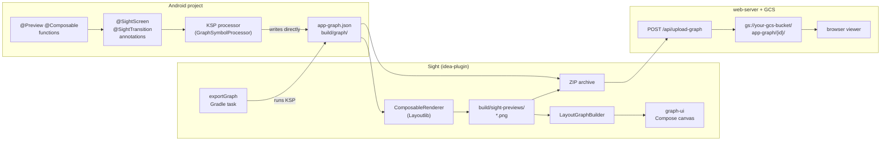

# Sight

Visualize your Android app's navigation graph from annotations on your `@Preview` composables.

## Pipeline



## Modules

| Module | Description |
|--------|-------------|
| `android/graph-annotations` | `@SightGraph`, `@SightScreen`, `@SightTransition` — apply these in your Android project |
| `android/graph-processor` | KSP processor that reads the annotations and writes `build/graph/app-graph-fragment.json` |
| `shared/graph-renderer` | Layout algorithm + data models. Pure JVM, no UI dependency |
| `shared/graph-ui` | Interactive Compose canvas — pan/zoom, hover highlighting, screenshot carousel |
| `idea-plugin/plugin` | IntelliJ/Android Studio tool window |
| `web-server` | Ktor server + browser UI for sharing/CI |
| `samples/android` | Minimal Android showcase (standalone Gradle project) |

## Quick start (sample)

```shell
cd samples/android
./gradlew :app:kspDebugKotlin
# → build/graph/app-graph-fragment.json
```

## Web server

```shell
./gradlew :web-server:run
# → http://localhost:8080
```

See [web-server/README.md](web-server/README.md) for Docker and Cloud deployment.
