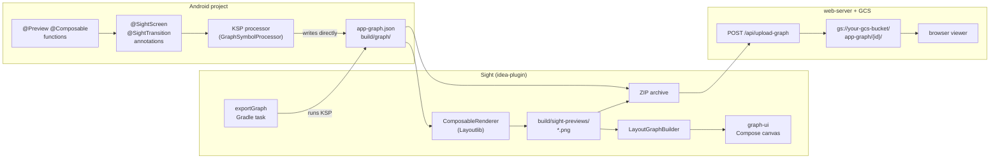

# Sight

> Visualize your Android app's navigation graph straight from the `@Preview` composables you already write.

[](https://central.sonatype.com/artifact/io.github.keymusicman/sight-gradle-plugin)
[](https://github.com/keymusicman/Sight/actions/workflows/ci.yml)
[](LICENSE)
[](https://kotlinlang.org)
[](CONTRIBUTING.md)
<!-- JetBrains Marketplace badge — the plugin is currently in moderation. Once it's live, replace <ID>
     with the numeric plugin id from the Marketplace URL and uncomment:
[](https://plugins.jetbrains.com/plugin/<ID>) -->

Sight turns the previews on your screens into a live, navigable map of your app: every screen, every
state, and the transitions between them — rendered with the real Layoutlib pipeline inside an
Android Studio tool window, exportable as images.

<!-- 📸 Drop a screenshot or GIF of the tool window here once you have one:
      -->

## How it works



## Install

Sight's Gradle plugin and libraries are published to **Maven Central** (the plugin is not on the
Gradle Plugin Portal), so add `mavenCentral()` to plugin resolution:

```kotlin
// settings.gradle.kts
pluginManagement {
    repositories {
        mavenCentral()
        gradlePluginPortal()
        google()
    }
}
```

```kotlin
// app/build.gradle.kts
plugins {
    id("io.github.keymusicman.sight") version "0.0.1"
}
```

The plugin applies KSP and wires `sight-annotations` (compile-only) and `sight-processor` (KSP)
for you — you don't depend on them directly.

The **Sight tool window** ships as an Android Studio plugin. It's currently in JetBrains Marketplace
moderation; until it's live you can build and install it from source (see
[CONTRIBUTING.md](CONTRIBUTING.md)). _(Coming soon to JetBrains Marketplace.)_

## Usage

Annotate your `@Preview` composables and declare the entry graph. Full semantics live in
[`docs/annotation-semantics.md`](docs/annotation-semantics.md); a complete, runnable example is in
[`samples/android`](samples/android).

```kotlin
// AppGraph.kt — the graph entry point
@SightGraph(name = "Sample App", entrySubgraph = "onboarding")
@SightTransition(
    fromSubgraph = "onboarding", fromScreen = "Login",
    toSubgraph = "main", toScreen = "Home", trigger = "login_success",
)
object AppGraph
```

```kotlin
// HomeScreen.kt — mark a @Preview as a screen node
@SightScreen(subgraph = "main", id = "Home", isRoot = true)
@Preview(name = "Default", showBackground = true)
@Composable
private fun HomePreview() = HomeScreen(/* … */)
```

Then generate the graph fragment:

```shell
./gradlew :app:kspDebugKotlin
# → app/build/graph/app-graph-fragment.json
```

…and open the **Sight** tool window in Android Studio to render and explore it. Try it against the
sample first:

```shell
cd samples/android
./gradlew :app:kspDebugKotlin
```

## Requirements

| | |
|---|---|
| JDK | 17 |
| Kotlin | 2.3.0 |
| KSP | 2.3.x |
| IDE plugin | Android Studio 2025.1+ (`since-build 251`, Android Studio only) |

## Modules

| Module | Description                                                                                                           |
|--------|-----------------------------------------------------------------------------------------------------------------------|
| `android/graph-annotations` | `@SightGraph`, `@SightScreen`, `@SightTransition` — apply these in your Android project                               |
| `android/graph-processor` | KSP processor that reads the annotations and writes `build/graph/app-graph-fragment.json`                             |
| `android/sight-gradle-plugin` | Gradle plugin (`io.github.keymusicman.sight`) — applies KSP, wires the annotations/processor, registers `exportGraph` |
| `shared/graph-renderer` | Layout algorithm + data models. Pure JVM, no UI dependency                                                            |
| `shared/graph-ui` | Interactive Compose canvas — pan/zoom, hover highlighting, screenshot carousel                                        |
| `idea-plugin/plugin` | IntelliJ/Android Studio tool window                                                                                   |
| `web-server` | Ktor server + browser UI for sharing/CI. Not ready to use                                                             |
| `samples/android` | Minimal Android showcase (standalone Gradle project)                                                                  |

## Roadmap

Planned and in-flight ideas live in [ROADMAP.md](ROADMAP.md). Want something on it? Open an issue.

## Contributing

Contributions are welcome — bug reports, ideas, and pull requests. Start with
[CONTRIBUTING.md](CONTRIBUTING.md) for the dev setup and workflow, and please follow our
[Code of Conduct](CODE_OF_CONDUCT.md).

## License

[Apache License 2.0](LICENSE) © Vasilii Maleev and the Sight contributors.
