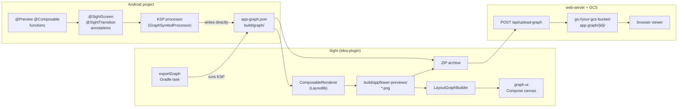

# Module Restructure & Docs Cleanup Implementation Plan

> **For agentic workers:** REQUIRED SUB-SKILL: Use superpowers:subagent-driven-development (recommended) or superpowers:executing-plans to implement this plan task-by-task. Steps use checkbox (`- [ ]`) syntax for tracking.

**Goal:** Reorganize the flat root-level modules into purposeful group directories, and clean up stale/misplaced docs — without changing any Gradle module paths.

**Architecture:** All eight Gradle modules are moved to new physical locations; `settings.gradle.kts` uses `project(":x").projectDir = file(...)` aliases so every existing `:module-name` reference in `build.gradle.kts` files, type-safe accessors, and CI scripts stays unchanged. Docs are deleted, moved, or trimmed per the spec.

**Tech Stack:** Gradle (Kotlin DSL), git mv, Kotlin/JVM

---

## File Map

| File | Change |
|------|--------|
| `settings.gradle.kts` | Replace flat `include` block with aliased version |
| `sample-android/settings.gradle.kts` → `samples/android/settings.gradle.kts` | Change `includeBuild("..")` → `includeBuild("../..") ` |
| `CLAUDE.md` | Update `sample-android` → `samples/android`, update `idea-plugin/` doc paths |
| `README.md` | Trim Cloud ops section, add Mermaid pipeline diagram, update module table |
| `web-server/README.md` | Create — receives the Docker/Cloud Run/GCS section from README.md |
| `docs/annotation-semantics.md` | Create by moving `EXAMPLE.md` |
| Deleted: `Claude_night_run.md`, `render-experiments.md`, `render-timings-chart.md`, `CODE_REFERENCE.md`, `render-worker/SPIKE_NOTES.md` (→ `idea-plugin/render-worker/SPIKE_NOTES.md` after Task 3), `idea-plugin/README.md` (→ `idea-plugin/plugin/README.md` after Task 3) | — |

---

## Task 1: Move android/ modules

**Files:**
- Move: `graph-annotations/` → `android/graph-annotations/`
- Move: `graph-processor/` → `android/graph-processor/`
- Modify: `settings.gradle.kts:45-46`

- [ ] **Step 1: Create group directory and move modules**

```bash
mkdir android
git mv graph-annotations android/graph-annotations
git mv graph-processor android/graph-processor
```

- [ ] **Step 2: Update settings.gradle.kts**

Replace lines 45-46:
```kotlin
// before
include(":graph-annotations")
include(":graph-processor")
```
```kotlin
// after
include(":graph-annotations")
project(":graph-annotations").projectDir = file("android/graph-annotations")

include(":graph-processor")
project(":graph-processor").projectDir = file("android/graph-processor")
```

- [ ] **Step 3: Verify build**

```bash
./gradlew :graph-annotations:compileKotlin :graph-processor:compileKotlin
```

Expected: `BUILD SUCCESSFUL`

- [ ] **Step 4: Commit**

```bash
git add settings.gradle.kts
git commit -m "move graph-annotations and graph-processor into android/"
```

---

## Task 2: Move shared/ modules

**Files:**
- Move: `graph-renderer/` → `shared/graph-renderer/`
- Move: `graph-ui/` → `shared/graph-ui/`
- Modify: `settings.gradle.kts:47-48`

- [ ] **Step 1: Create group directory and move modules**

```bash
mkdir shared
git mv graph-renderer shared/graph-renderer
git mv graph-ui shared/graph-ui
```

- [ ] **Step 2: Update settings.gradle.kts**

Replace lines 47-48 (now pointing to old paths):
```kotlin
// before
include(":graph-renderer")
include(":graph-ui")
```
```kotlin
// after
include(":graph-renderer")
project(":graph-renderer").projectDir = file("shared/graph-renderer")

include(":graph-ui")
project(":graph-ui").projectDir = file("shared/graph-ui")
```

- [ ] **Step 3: Verify build**

```bash
./gradlew :graph-renderer:compileKotlin :graph-ui:compileKotlinJvm
```

Expected: `BUILD SUCCESSFUL`

- [ ] **Step 4: Commit**

```bash
git add settings.gradle.kts
git commit -m "move graph-renderer and graph-ui into shared/"
```

---

## Task 3: Restructure idea-plugin/ group

The existing `idea-plugin/` directory must become a group directory. Since you can't rename a directory to itself, rename it to a temp name first.

**Files:**
- Move: `idea-plugin/` → `idea-plugin/plugin/` (via temp rename)
- Move: `ipc/` → `idea-plugin/ipc/`
- Move: `render-worker/` → `idea-plugin/render-worker/`
- Modify: `settings.gradle.kts:49,51-52`

- [ ] **Step 1: Rename existing module to temp, create group dir, move back**

```bash
git mv idea-plugin idea-plugin-tmp
mkdir idea-plugin
git mv idea-plugin-tmp idea-plugin/plugin
```

- [ ] **Step 2: Move ipc and render-worker into group**

```bash
git mv ipc idea-plugin/ipc
git mv render-worker idea-plugin/render-worker
```

- [ ] **Step 3: Update settings.gradle.kts**

Replace the three affected includes (`:idea-plugin`, `:ipc`, `:render-worker`):
```kotlin
// before
include(":idea-plugin")
include(":web-server")
include(":ipc")
include(":render-worker")
```
```kotlin
// after
include(":idea-plugin")
project(":idea-plugin").projectDir = file("idea-plugin/plugin")

include(":web-server")

include(":ipc")
project(":ipc").projectDir = file("idea-plugin/ipc")

include(":render-worker")
project(":render-worker").projectDir = file("idea-plugin/render-worker")
```

- [ ] **Step 4: Verify build**

```bash
./gradlew :idea-plugin:compileKotlin :ipc:compileKotlin :render-worker:compileKotlin
```

Expected: `BUILD SUCCESSFUL`

- [ ] **Step 5: Commit**

```bash
git add settings.gradle.kts
git commit -m "restructure idea-plugin/ as group dir with plugin/, ipc/, render-worker/"
```

---

## Task 4: Move sample-android → samples/android/

**Files:**
- Move: `sample-android/` → `samples/android/`
- Modify: `samples/android/settings.gradle.kts` (one line)

- [ ] **Step 1: Create group directory and move**

```bash
mkdir samples
git mv sample-android samples/android
```

- [ ] **Step 2: Fix includeBuild path**

In `samples/android/settings.gradle.kts`, the `includeBuild` now needs to go two levels up to reach the root project. Change:
```kotlin
// before
includeBuild("..")
```
```kotlin
// after
includeBuild("../..") 
```

- [ ] **Step 3: Verify sample still compiles**

```bash
cd samples/android && ./gradlew :app:kspDebugKotlin
```

Expected: `BUILD SUCCESSFUL` and `build/graph/app-graph-fragment.json` produced.

- [ ] **Step 4: Commit**

```bash
cd ../..
git add samples/
git commit -m "move sample-android into samples/android/"
```

---

## Task 5: Full build verification

- [ ] **Step 1: Run full build from root**

```bash
./gradlew build
```

Expected: `BUILD SUCCESSFUL`. If anything fails, fix before continuing — the remaining tasks are docs-only and do not affect the build.

- [ ] **Step 2: Commit any fixes**

If Step 1 required changes, commit them:
```bash
git add -p
git commit -m "fix: post-restructure build issues"
```

If the build passed clean, no commit needed.

---

## Task 6: Delete stale docs

After Task 3, paths have shifted: `render-worker/SPIKE_NOTES.md` is now at `idea-plugin/render-worker/SPIKE_NOTES.md`, and `idea-plugin/README.md` is now at `idea-plugin/plugin/README.md`.

- [ ] **Step 1: Delete all six stale files**

```bash
git rm Claude_night_run.md \
    render-experiments.md \
    render-timings-chart.md \
    CODE_REFERENCE.md \
    idea-plugin/render-worker/SPIKE_NOTES.md \
    idea-plugin/plugin/README.md
```

- [ ] **Step 2: Commit**

```bash
git commit -m "delete stale and outdated docs"
```

---

## Task 7: Update README.md and create web-server/README.md

The current `README.md` has a full Cloud Run + GCS + CDN ops runbook (lines 32–115) that belongs in `web-server/`. The Mermaid pipeline diagram from `CODE_REFERENCE.md` (now deleted) belongs in the root README.

**Files:**
- Modify: `README.md`
- Create: `web-server/README.md`

- [ ] **Step 1: Create web-server/README.md**

Create `web-server/README.md` with the ops content extracted from `README.md`:

```markdown
# Sight Web Server

Ktor HTTP server on port 8080. Accepts ZIP uploads (`app-graph.json` + `screenshots/`),
builds layout, stores on Google Cloud Storage, and serves a browser UI.
Set `GCS_BUCKET` env var to your bucket name.

## Run locally

```shell
./gradlew :web-server:run
# → http://localhost:8080
```

## Docker

```shell
docker build -t sight-web:latest .
docker run --rm -p 8080:8080 -e GCS_BUCKET=your-gcs-bucket sight-web:latest
```

## Google Cloud deployment (Cloud Run + GCS + CDN)

Set variables:

```shell
PROJECT_ID="<your-project-id>"
REGION="us-central1"
SERVICE="sight-web"
BUCKET="your-gcs-bucket"
SA="sight-web-sa"
DOMAIN="graph.example.com"
```

Create bucket and CORS:

```shell
gcloud config set project "$PROJECT_ID"
gcloud storage buckets create "gs://$BUCKET" --location="$REGION" --uniform-bucket-level-access
gcloud storage buckets update "gs://$BUCKET" --cors-file=<(cat <<'JSON'
[
  {
    "origin": ["*"],
    "method": ["GET", "POST", "DELETE", "OPTIONS"],
    "responseHeader": ["Content-Type"],
    "maxAgeSeconds": 3600
  }
]
JSON
)
```

Create service account and grant bucket access:

```shell
gcloud iam service-accounts create "$SA" --display-name="Sight Web Service"
gcloud storage buckets add-iam-policy-binding "gs://$BUCKET" \
  --member="serviceAccount:$SA@$PROJECT_ID.iam.gserviceaccount.com" \
  --role="roles/storage.objectAdmin"
```

Build and deploy Cloud Run:

```shell
gcloud builds submit --tag "gcr.io/$PROJECT_ID/$SERVICE:latest"
gcloud run deploy "$SERVICE" \
  --image "gcr.io/$PROJECT_ID/$SERVICE:latest" \
  --region "$REGION" \
  --platform managed \
  --allow-unauthenticated \
  --service-account "$SA@$PROJECT_ID.iam.gserviceaccount.com" \
  --set-env-vars "GCS_BUCKET=$BUCKET"
```

Cloud CDN in front of bucket:

```shell
gcloud compute backend-buckets create sight-gcs-backend \
  --gcs-bucket-name="$BUCKET" \
  --enable-cdn
gcloud compute url-maps create sight-map --default-backend-bucket=sight-gcs-backend
gcloud compute ssl-certificates create sight-cert \
  --domains="$DOMAIN" \
  --global
gcloud compute target-https-proxies create sight-https-proxy \
  --url-map=sight-map \
  --ssl-certificates=sight-cert
gcloud compute forwarding-rules create sight-https-rule \
  --global \
  --target-https-proxy=sight-https-proxy \
  --ports=443
```

Then map DNS `A/AAAA` records to the global load balancer IP and verify certificate status:

```shell
gcloud compute ssl-certificates describe sight-cert --global
```
```

- [ ] **Step 2: Rewrite README.md**

Replace the entire contents of `README.md` with:

```markdown
# Sight

Visualize your Android app's navigation graph from annotations on your `@Preview` composables.

## Pipeline



## Modules

| Module | Description |
|--------|-------------|
| `android/graph-annotations` | `@SightGraph`, `@SightScreen`, `@SightTransition` — apply these in your Android project |
| `android/graph-processor` | KSP processor that reads the annotations and writes `build/graph/app-graph-fragment.json` |
| `shared/graph-renderer` | Layout algorithm + data models. Pure JVM, no UI dependency |
| `shared/graph-ui` | Interactive Compose canvas — pan/zoom, hover highlighting, screenshot carousel |
| `idea-plugin/plugin` | IntelliJ/Android Studio tool window |
| `web-server` | Ktor server + browser UI for sharing/CI |
| `samples/android` | Minimal Android showcase (standalone Gradle project) |

## Quick start (sample)

```shell
cd samples/android
./gradlew :app:kspDebugKotlin
# → build/graph/app-graph-fragment.json
```

## Web server

```shell
./gradlew :web-server:run
# → http://localhost:8080
```

See [web-server/README.md](web-server/README.md) for Docker and Cloud deployment.
```

- [ ] **Step 3: Commit**

```bash
git add README.md web-server/README.md
git commit -m "move Cloud ops docs to web-server/README.md, add pipeline diagram to root README"
```

---

## Task 8: Move EXAMPLE.md → docs/annotation-semantics.md

- [ ] **Step 1: Move the file**

```bash
git mv EXAMPLE.md docs/annotation-semantics.md
```

- [ ] **Step 2: Commit**

```bash
git commit -m "rename EXAMPLE.md to docs/annotation-semantics.md"
```

---

## Task 9: Update CLAUDE.md

Three things changed that CLAUDE.md references:
1. `cd sample-android` → `cd samples/android`
2. `idea-plugin/COMPOSABLE_RENDERING.md` → `idea-plugin/plugin/COMPOSABLE_RENDERING.md`
3. `idea-plugin/LOCAL_REPRO.md` → `idea-plugin/LOCAL_REPRO.md` → `idea-plugin/plugin/LOCAL_REPRO.md`
4. `idea-plugin/local-repro/run.sh` → `idea-plugin/plugin/local-repro/run.sh`
5. `sample-android/` description → `samples/android/`
6. Key files table: `idea-plugin/src/...` → `idea-plugin/plugin/src/...`

**Files:**
- Modify: `CLAUDE.md`

- [ ] **Step 1: Update the sample command (line 28)**

```
// before
cd sample-android && ./gradlew :app:kspDebugKotlin

// after
cd samples/android && ./gradlew :app:kspDebugKotlin
```

- [ ] **Step 2: Update idea-plugin doc links (lines 73-75)**

```
// before
**Composable rendering**: see [`idea-plugin/COMPOSABLE_RENDERING.md`](idea-plugin/COMPOSABLE_RENDERING.md)
**Debugging the subprocess renderer**: see [`idea-plugin/LOCAL_REPRO.md`](idea-plugin/LOCAL_REPRO.md) for the local repro harness (`idea-plugin/local-repro/run.sh`)

// after
**Composable rendering**: see [`idea-plugin/plugin/COMPOSABLE_RENDERING.md`](idea-plugin/plugin/COMPOSABLE_RENDERING.md)
**Debugging the subprocess renderer**: see [`idea-plugin/plugin/LOCAL_REPRO.md`](idea-plugin/plugin/LOCAL_REPRO.md) for the local repro harness (`idea-plugin/plugin/local-repro/run.sh`)
```

- [ ] **Step 3: Update sample-android module description (lines 77-78)**

```
// before
### sample-android
Standalone Gradle project (`sample-android/`). Demonstrates annotation usage — 4 screens across 3 subgraphs, 3 preview states each. Uses `includeBuild("..")` composite build to depend on `:graph-annotations` and `:graph-processor` directly from source.

// after
### samples/android
Standalone Gradle project (`samples/android/`). Demonstrates annotation usage — 4 screens across 3 subgraphs, 3 preview states each. Uses `includeBuild("../..") ` composite build to depend on `:graph-annotations` and `:graph-processor` directly from source.
```

- [ ] **Step 4: Update key files table entry (line 99)**

```
// before
| `idea-plugin/src/main/kotlin/.../FlowToolWindowFactory.kt` | IntelliJ tool window entry point |

// after
| `idea-plugin/plugin/src/main/kotlin/.../FlowToolWindowFactory.kt` | IntelliJ tool window entry point |
```

- [ ] **Step 5: Commit**

```bash
git add CLAUDE.md
git commit -m "update CLAUDE.md paths after module restructure"
```
