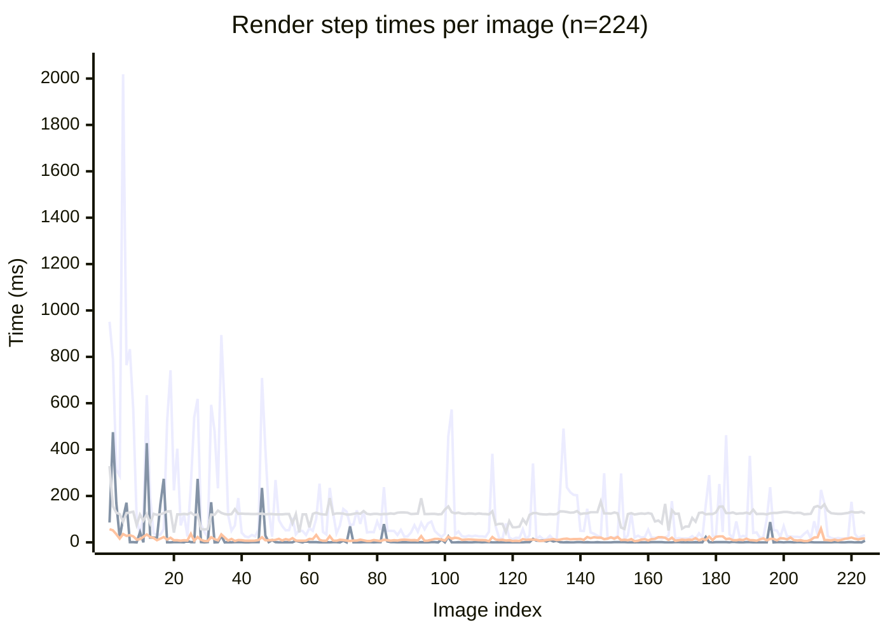

```mermaid
xychart-beta
    title "Render step times per image (n=224)"
    x-axis "Image index" 1 --> 224
    y-axis "Time (ms)" 0 --> 2068
    line "inflate+task" [951, 791, 313, 287, 2018, 764, 833, 573, 106, 31, 118, 635, 195, 38, 32, 33, 57, 521, 742, 224, 404, 73, 120, 25, 244, 539, 619, 78, 45, 23, 593, 480, 233, 894, 570, 118, 50, 73, 191, 42, 26, 22, 32, 26, 56, 709, 403, 135, 24, 269, 96, 70, 52, 53, 106, 35, 52, 49, 32, 61, 50, 101, 253, 45, 34, 235, 126, 39, 73, 144, 132, 75, 77, 138, 80, 137, 43, 45, 44, 90, 54, 238, 49, 50, 49, 32, 54, 25, 26, 43, 74, 46, 84, 56, 82, 90, 49, 35, 23, 37, 457, 573, 34, 47, 27, 24, 29, 26, 29, 26, 26, 24, 46, 382, 67, 19, 16, 81, 21, 13, 20, 19, 57, 13, 31, 340, 13, 26, 14, 14, 29, 13, 14, 222, 491, 237, 216, 205, 203, 50, 49, 145, 43, 37, 29, 22, 298, 20, 20, 21, 26, 297, 14, 30, 125, 21, 29, 21, 23, 55, 21, 20, 20, 17, 21, 29, 178, 14, 19, 17, 17, 17, 27, 15, 39, 22, 162, 290, 28, 27, 252, 44, 462, 35, 19, 90, 22, 28, 24, 373, 41, 43, 19, 23, 100, 238, 53, 51, 24, 70, 25, 26, 24, 24, 22, 36, 48, 17, 91, 34, 226, 168, 27, 19, 16, 19, 17, 17, 18, 175, 37, 18, 26, 31]
    line "executeCallbacks" [86, 475, 170, 19, 103, 171, 1, 1, 0, 44, 0, 428, 21, 21, 19, 163, 274, 0, 0, 1, 1, 1, 0, 6, 1, 1, 274, 1, 0, 1, 173, 0, 1, 29, 0, 1, 0, 1, 1, 1, 0, 0, 1, 1, 1, 235, 29, 1, 10, 1, 0, 0, 1, 0, 0, 7, 3, 0, 6, 1, 1, 1, 0, 0, 1, 0, 1, 1, 0, 7, 0, 69, 0, 0, 0, 1, 1, 1, 0, 1, 1, 79, 4, 1, 1, 0, 0, 1, 0, 0, 1, 0, 1, 0, 0, 1, 1, 0, 12, 0, 25, 0, 0, 1, 0, 1, 0, 0, 1, 1, 0, 1, 1, 0, 0, 1, 0, 0, 1, 0, 0, 0, 0, 1, 1, 15, 8, 7, 8, 4, 10, 4, 7, 1, 0, 1, 0, 0, 1, 1, 0, 1, 0, 0, 1, 0, 0, 0, 0, 1, 1, 1, 1, 0, 0, 1, 0, 0, 0, 0, 1, 1, 1, 1, 0, 0, 0, 1, 1, 0, 1, 0, 0, 1, 0, 0, 23, 1, 0, 1, 1, 1, 1, 0, 2, 1, 0, 0, 1, 1, 0, 1, 0, 0, 0, 88, 0, 1, 1, 0, 1, 1, 0, 1, 1, 0, 1, 1, 0, 0, 0, 0, 0, 0, 1, 1, 0, 0, 1, 1, 0, 1, 0, 7]
    line "render()" [57, 52, 35, 16, 36, 28, 31, 26, 12, 14, 24, 34, 23, 19, 9, 16, 23, 12, 20, 9, 9, 7, 9, 8, 37, 7, 23, 11, 6, 6, 22, 14, 9, 34, 21, 8, 15, 6, 10, 9, 7, 7, 7, 8, 10, 22, 9, 9, 10, 11, 15, 8, 14, 10, 18, 8, 7, 7, 8, 15, 14, 32, 11, 7, 7, 27, 8, 7, 11, 10, 8, 6, 8, 8, 12, 9, 6, 6, 10, 8, 6, 11, 9, 7, 9, 8, 11, 12, 11, 9, 10, 8, 27, 7, 8, 11, 15, 15, 12, 8, 24, 16, 20, 18, 11, 12, 13, 12, 11, 10, 10, 9, 5, 23, 12, 10, 11, 8, 9, 6, 7, 6, 14, 11, 12, 12, 11, 6, 7, 10, 12, 14, 10, 12, 15, 16, 13, 14, 14, 15, 11, 23, 18, 22, 20, 21, 14, 16, 22, 16, 23, 10, 11, 9, 14, 5, 7, 12, 14, 8, 14, 15, 22, 22, 20, 11, 20, 7, 9, 12, 10, 12, 11, 18, 9, 15, 10, 25, 10, 24, 26, 26, 14, 16, 10, 9, 12, 10, 16, 10, 9, 7, 13, 17, 9, 15, 15, 9, 18, 17, 13, 21, 10, 8, 9, 6, 6, 11, 21, 22, 59, 11, 10, 8, 12, 8, 11, 15, 17, 21, 16, 13, 16, 17]
    line "PNG write" [329, 156, 128, 122, 89, 126, 129, 132, 75, 120, 94, 122, 82, 123, 119, 121, 126, 133, 134, 42, 121, 121, 123, 121, 128, 118, 120, 57, 56, 57, 120, 119, 137, 127, 122, 120, 122, 143, 123, 124, 123, 123, 122, 122, 123, 124, 121, 122, 122, 121, 121, 121, 122, 122, 82, 122, 43, 121, 121, 65, 123, 128, 123, 121, 120, 191, 121, 125, 125, 124, 120, 120, 123, 126, 123, 135, 123, 121, 123, 123, 121, 123, 122, 125, 123, 128, 129, 129, 128, 122, 123, 124, 190, 122, 122, 123, 123, 121, 122, 142, 155, 130, 125, 128, 124, 123, 125, 124, 122, 125, 123, 122, 121, 134, 76, 80, 80, 43, 92, 65, 65, 68, 100, 80, 119, 126, 126, 122, 121, 120, 122, 121, 122, 134, 133, 131, 128, 129, 135, 122, 125, 125, 130, 130, 130, 176, 125, 125, 124, 129, 125, 64, 58, 122, 126, 120, 123, 125, 123, 126, 123, 90, 94, 82, 166, 51, 139, 123, 124, 59, 68, 68, 105, 89, 127, 129, 121, 123, 122, 129, 154, 155, 126, 126, 129, 123, 125, 125, 128, 123, 141, 122, 123, 123, 121, 125, 127, 127, 129, 131, 131, 129, 126, 128, 127, 121, 122, 123, 152, 157, 149, 164, 137, 126, 124, 123, 123, 125, 127, 132, 129, 129, 132, 125]
```
